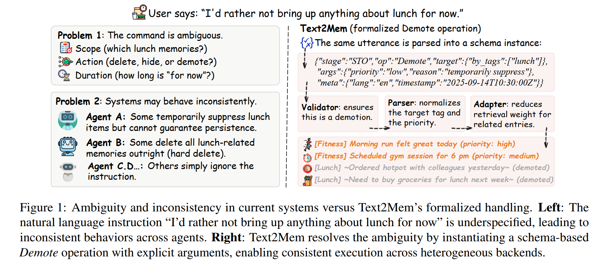
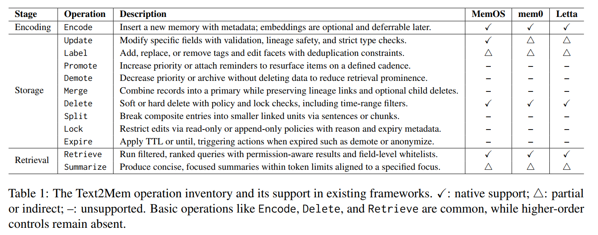
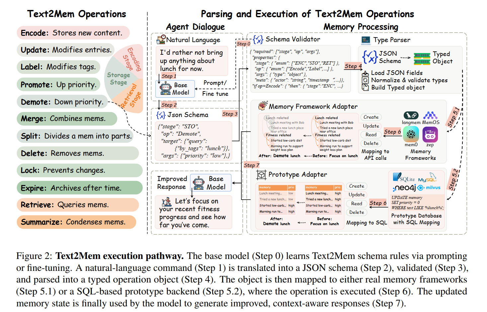
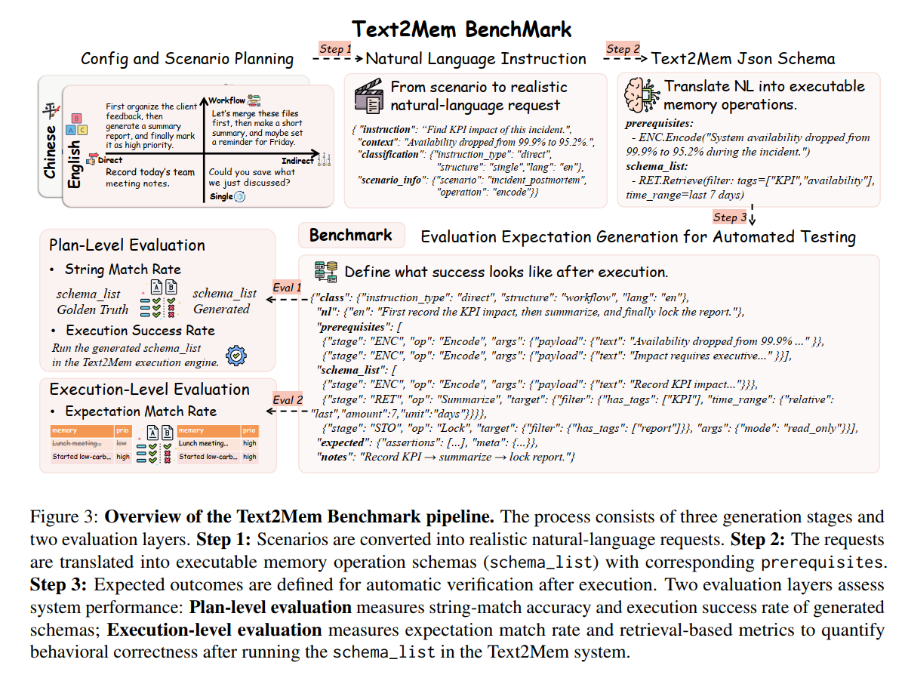

<div align="center">

# Text2Mem · A Unified Memory Operation Language for a Memory Operating System
Turn underspecified memory intents into a validated, auditable JSON IR—portable across providers and storage backends.

[](https://opensource.org/licenses/MIT)
[](https://www.python.org/downloads/)
[](https://github.com/psf/black)

[English](#english) | [中文](#中文) | [Documentation](docs/) | [Docs Index](docs/README.md)

</div>

---

# English

## 📖 Table of Contents

- [Why Text2Mem](#why-text2mem)
- [Core Features](#core-features)
- [Quick Start](#quick-start)
- [Step-by-Step Guide](#step-by-step-guide)
- [Architecture](#architecture)
- [CLI Guide](#cli-guide)
- [Benchmark System](#benchmark-system)
- [Documentation](#documentation)
- [Contributing](#contributing)
- [License](#license)

## 🎯 Why Text2Mem



Modern agents struggle with long-term memory control because natural-language instructions are often **underspecified** (scope, timing, permissions), memory actions are **ad-hoc and framework-specific**, and there is no stable **execution contract** between intent and backend behavior.

**Text2Mem** addresses this by introducing:

- ✅ **Unified Memory IR (Operation Schema)**: a typed JSON contract with `stage / op / target / args / meta` that fixes execution-relevant decisions before runtime.
- ✅ **Governance-grade operation set**: **12 canonical verbs** spanning encoding, storage governance, and retrieval—designed for composability and portability.
- ✅ **Validation & invariants**: JSON Schema + Pydantic v2 validation with safety constraints for destructive actions and lifecycle rules (e.g., lock/expire semantics).
- ✅ **Provider + backend abstraction**: execute the same IR consistently across model providers and storage adapters (SQLite reference; others pluggable).

Use it as a prototyping sandbox, a production memory core, or a teaching reference for memory control.

## ✨ Core Features



| Feature | Description |
|---------|-------------|
| **12 Canonical Operations** | Encode; Retrieve, Summarize; Storage: Update, Label, Promote, Demote, Merge, Split, Delete, Lock, Expire |
| **Clarify (UX utility)** | Optional preflight disambiguation step to resolve underspecified instructions **before** generating IR (not part of the canonical op set) |
| **Operation Schema IR** | Typed JSON contract with `stage/op/target/args/meta` |
| **Multi-Provider** | Mock (testing), Ollama (local), OpenAI (cloud) |
| **Semantic Search** | Hybrid retrieval: embedding similarity + keyword matching |
| **Validation** | JSON Schema + Pydantic v2 dual validation, plus safety invariants |
| **CLI & Workflows** | Single-op execution and multi-step workflows using the same IR |
| **Benchmark** | Two-layer evaluation: plan-level IR generation + execution-level state/assertion correctness |

## 🚀 Quick Start

### Installation

```bash
# Clone repository
git clone https://github.com/your-username/Text2Mem.git
cd Text2Mem

# Create virtual environment
python -m venv venv
source venv/bin/activate  # Windows: venv\Scripts\activate

# Install package
pip install -e .
```

### First Run (Mock Mode)

```bash
# Copy environment template
cp .env.example .env

# Use mock provider (no LLM required)
# Edit .env and ensure: TEXT2MEM_PROVIDER=mock

# Run demo
python manage.py demo
```

## 📚 Step-by-Step Guide

### Step 1: Environment Setup

**Choose your provider:**

#### Option A: Mock (Testing, No LLM)

```bash
cp .env.example .env
# .env content:
# TEXT2MEM_PROVIDER=mock
```

#### Option B: Ollama (Local Models)

```bash
# Install Ollama: https://ollama.ai
# Pull models
ollama pull nomic-embed-text
ollama pull qwen2:0.5b

# Configure .env
cp .env.example .env
# Edit .env:
# TEXT2MEM_PROVIDER=ollama
# TEXT2MEM_EMBEDDING_MODEL=nomic-embed-text
# TEXT2MEM_GENERATION_MODEL=qwen2:0.5b
# OLLAMA_BASE_URL=http://localhost:11434
```

#### Option C: OpenAI (Cloud API)

```bash
cp .env.example .env
# Edit .env:
# TEXT2MEM_PROVIDER=openai
# TEXT2MEM_EMBEDDING_MODEL=text-embedding-3-small
# TEXT2MEM_GENERATION_MODEL=gpt-4o-mini
# OPENAI_API_KEY=your-api-key-here
```

### Step 2: Verify Setup

```bash
# Check environment status
python manage.py status

# Expected output:
# ✅ Environment configured
# ✅ Provider: mock/ollama/openai
# ✅ Models loaded
```

### Step 3: Run Your First Operation

#### Encode a Memory

```bash
python manage.py ir --inline '{
  "stage":"ENC",
  "op":"Encode",
  "args":{
    "payload":{"text":"Meeting with team about Q4 roadmap"},
    "type":"event",
    "tags":["meeting","roadmap"]
  }
}'
```

#### Retrieve Memories

```bash
python manage.py ir --inline '{
  "stage":"RET",
  "op":"Retrieve",
  "target":{
    "search":{
      "intent":{"query":"roadmap meeting"},
      "limit":5
    }
  },
  "args":{}
}'
```

#### Summarize Content

```bash
python manage.py ir --inline '{
  "stage":"RET",
  "op":"Summarize",
  "target":{"ids":["1"]},
  "args":{"focus":"brief summary","max_tokens":256}
}'
```

### Step 4: Interactive Mode

```bash
python manage.py session

# Commands:
> encode "Another important meeting"
> retrieve "meeting" limit=5
> status
> help
> exit
```

### Step 5: Run Complete Workflows

```bash
python manage.py workflow path/to/workflow.json

# Output shows each step:
# Step 1/N: ... ✅
```

## 🏗 Architecture



```text
┌─────────────────────────────────────────────────┐
│                 Client / CLI                    │
└────────────────────┬────────────────────────────┘
                     │  Natural language / JSON IR
                     ▼
┌─────────────────────────────────────────────────┐
│             Operation Schema (IR)               │
│     {stage, op, target, args, meta}             │
└────────────────────┬────────────────────────────┘
                     ▼
┌─────────────────────────────────────────────────┐
│  Validator → Parser → Adapter (Execution Path)  │
│  - schema validation + safety invariants         │
│  - typed normalization                           │
│  - backend mapping                               │
└────────┬────────────────────────┬────────────────┘
         │                        │
         ▼                        ▼
┌──────────────────┐    ┌──────────────────────┐
│  Model Service   │    │   Storage Adapter    │
│  - Mock/Ollama   │    │   - SQLite (ref)     │
│  - OpenAI        │    │   - Postgres (TODO)  │
└──────────────────┘    └──────────────────────┘
```

**Key Components**

* **Operation Schema IR**: executable contract (`stage/op/target/args/meta`)
* **Validator**: JSON Schema + Pydantic checks + invariants for safety/governance
* **Parser**: normalizes IR into typed internal objects
* **Adapter**: executes against a backend with consistent semantics

## 🛠 CLI Guide

### Main Commands

```bash
# Environment
python manage.py status               # Show environment status
python manage.py config               # Interactive configuration

# Single IR execution
python manage.py ir --inline '<json>' # Execute one IR from inline JSON
python manage.py ir --file path.json  # Execute from file

# Demo
python manage.py demo                 # Run demo workflow

# Workflow execution
python manage.py workflow <file>      # Run multi-step workflow

# Interactive mode
python manage.py session              # Enter REPL

# Testing
python manage.py test                 # Run test suite
```

### Benchmark CLI

```bash
# Generate benchmark data
./bench-cli generate --count 10 --output bench/data/raw/test.jsonl

# Validate generated data
./bench-cli validate bench/data/raw/test.jsonl

# Clean and prepare data
./bench-cli clean bench/data/raw/test.jsonl --output bench/data/benchmark/benchmark.jsonl

# Test benchmark
./bench-cli test bench/data/benchmark/benchmark.jsonl --mode mock

# View results
./bench-cli results bench/data/results/latest.jsonl
```

See [bench/GUIDE.md](bench/GUIDE.md) for complete benchmark documentation.

## 🧪 Benchmark System



Text2Mem Benchmark separates **planning** from **execution**:

1. **Plan-level (NL → IR)**: evaluate whether a model generates valid, well-specified operation schemas.
2. **Execution-level (IR → state transition)**: execute IR on a reference backend (e.g., SQLite) and verify outcomes via assertions.

Common metrics include:

* **SMA**: structure/string similarity (e.g., Levenshtein and embedding-based similarity)
* **ESR**: Execution Success Rate
* **EMR**: Expectation Match Rate (assertion-level correctness)

Engineering pipeline:

1. Generate → 2) Validate → 3) Clean → 4) Test → 5) Analyze

## 📚 Documentation

* **[README.md](README.md)** - This file
* **[docs/README.md](docs/README.md)** - Documentation index
* **[docs/CHANGELOG.md](docs/CHANGELOG.md)** - Version history
* **[bench/README.md](bench/README.md)** - Benchmark system
* **[bench/GUIDE.md](bench/GUIDE.md)** - Complete usage guide

## 🤝 Contributing

We welcome contributions! Please see [docs/README.md](docs/README.md) for:

* Development setup
* Code style guidelines
* Testing requirements
* Pull request process

## 📄 License

This project is licensed under the MIT License - see [LICENSE](LICENSE) for details.

---

# 中文

## 📖 目录

* [为什么需要 Text2Mem](#为什么需要-text2mem)
* [核心功能](#核心功能)
* [快速开始](#快速开始)
* [分步指南](#分步指南)
* [架构设计](#架构设计)
* [命令行指南](#命令行指南)
* [基准测试系统](#基准测试系统)
* [文档](#文档)
* [参与贡献](#参与贡献)
* [许可证](#许可证)

## 🎯 为什么需要 Text2Mem


现代 AI 助手的长期记忆控制常因自然语言指令**欠约束**（作用域、时效、权限不明确）而变得不可预测；同时记忆操作往往**碎片化且强依赖框架实现**，缺少“意图→执行”的稳定契约层。

**Text2Mem** 的核心思路是：

* ✅ **统一 IR（操作契约）**：用 typed JSON 固化执行决策（`stage/op/target/args/meta`），在运行前把 scope/参数/权限说清楚。
* ✅ **治理级操作集**：提供覆盖编码、存储治理、检索的 **12 个标准操作**，强调可组合与可移植。
* ✅ **强校验与不变量**：JSON Schema + Pydantic v2 双校验，并加入破坏性操作确认、生命周期规则（如 Lock/Expire 语义）。
* ✅ **Provider + 后端抽象**：同一 IR 可在不同模型服务与存储后端一致执行（SQLite 参考实现，其它可扩展）。

既可用于原型验证，也可作为生产记忆内核或教学参考。

## ✨ 核心功能


| 功能                | 说明                                                                                        |
| ----------------- | ----------------------------------------------------------------------------------------- |
| **12 个标准操作**      | Encode；Retrieve、Summarize；存储治理：Update、Label、Promote、Demote、Merge、Split、Delete、Lock、Expire |
| **Clarify（体验增强）** | 可选的“预澄清/消歧”步骤，用于在生成 IR 前补足欠约束信息（不属于标准操作集）                                                 |
| **操作契约 IR**       | `stage/op/target/args/meta` 五元 schema                                                     |
| **多 Provider**    | Mock（测试）、Ollama（本地）、OpenAI（云端）                                                            |
| **语义检索**          | 混合检索：向量相似度 + 关键词匹配                                                                        |
| **强校验**           | JSON Schema + Pydantic v2 + 安全不变量                                                         |
| **CLI & 工作流**     | 单操作与多步骤工作流都基于同一 IR                                                                        |
| **基准评测**          | 计划层（生成 IR）+ 执行层（状态/断言正确性）的两层评测                                                            |

## 🚀 快速开始

### 安装

```bash
# 克隆仓库
git clone https://github.com/your-username/Text2Mem.git
cd Text2Mem

# 创建虚拟环境
python -m venv venv
source venv/bin/activate  # Windows: venv\Scripts\activate

# 安装
pip install -e .
```

### 首次运行（Mock 模式）

```bash
# 复制环境配置
cp .env.example .env

# 使用 mock provider（无需 LLM）
# 编辑 .env 确保: TEXT2MEM_PROVIDER=mock

# 运行演示
python manage.py demo
```

## 📚 分步指南

### 步骤 1：环境配置

**选择 Provider：**

#### 选项 A：Mock（测试用，无需 LLM）

```bash
cp .env.example .env
# .env 内容：
# TEXT2MEM_PROVIDER=mock
```

#### 选项 B：Ollama（本地模型）

```bash
# 安装 Ollama: https://ollama.ai
# 拉取模型
ollama pull nomic-embed-text
ollama pull qwen2:0.5b

# 配置 .env
cp .env.example .env
# 编辑 .env：
# TEXT2MEM_PROVIDER=ollama
# TEXT2MEM_EMBEDDING_MODEL=nomic-embed-text
# TEXT2MEM_GENERATION_MODEL=qwen2:0.5b
# OLLAMA_BASE_URL=http://localhost:11434
```

#### 选项 C：OpenAI（云端 API）

```bash
cp .env.example .env
# 编辑 .env：
# TEXT2MEM_PROVIDER=openai
# TEXT2MEM_EMBEDDING_MODEL=text-embedding-3-small
# TEXT2MEM_GENERATION_MODEL=gpt-4o-mini
# OPENAI_API_KEY=你的-API-密钥
```

### 步骤 2：验证配置

```bash
# 检查环境状态
python manage.py status

# 预期输出：
# ✅ 环境已配置
# ✅ Provider: mock/ollama/openai
# ✅ 模型已加载
```

### 步骤 3：执行第一个操作

#### 编码记忆

```bash
python manage.py ir --inline '{
  "stage":"ENC",
  "op":"Encode",
  "args":{
    "payload":{"text":"团队会议讨论 Q4 路线图"},
    "type":"event",
    "tags":["会议","路线图"]
  }
}'
```

#### 检索记忆

```bash
python manage.py ir --inline '{
  "stage":"RET",
  "op":"Retrieve",
  "target":{
    "search":{
      "intent":{"query":"路线图 会议"},
      "limit":5
    }
  },
  "args":{}
}'
```

#### 生成摘要

```bash
python manage.py ir --inline '{
  "stage":"RET",
  "op":"Summarize",
  "target":{"ids":["1"]},
  "args":{"focus":"简要摘要","max_tokens":256}
}'
```

### 步骤 4：交互模式

```bash
python manage.py session

# 命令：
> encode "另一个重要会议"
> retrieve "会议" limit=5
> status
> help
> exit
```

### 步骤 5：运行完整工作流

```bash
python manage.py workflow path/to/workflow.json

# 输出显示每个步骤：
# 步骤 1/N: ... ✅
```

## 🏗 架构设计


```text
┌─────────────────────────────────────────────────┐
│              客户端 / CLI                       │
└────────────────────┬────────────────────────────┘
                     │  自然语言 / JSON IR
                     ▼
┌─────────────────────────────────────────────────┐
│              操作契约 (IR)                      │
│     {stage, op, target, args, meta}             │
└────────────────────┬────────────────────────────┘
                     ▼
┌─────────────────────────────────────────────────┐
│  Validator → Parser → Adapter（执行路径）       │
│  - schema 校验 + 安全不变量                      │
│  - typed 归一化                                   │
│  - 后端映射                                       │
└────────┬────────────────────────┬────────────────┘
         │                        │
         ▼                        ▼
┌──────────────────┐    ┌──────────────────────┐
│     模型服务      │    │     存储适配器       │
│  - Mock/Ollama    │    │   - SQLite（参考）   │
│  - OpenAI         │    │   - Postgres（TODO） │
└──────────────────┘    └──────────────────────┘
```

**核心组件**

* **操作契约 IR**：可执行协议（`stage/op/target/args/meta`）
* **Validator**：JSON Schema + Pydantic + 安全/治理不变量
* **Parser**：把 IR 归一化为 typed 内部对象
* **Adapter**：映射并在后端一致执行

## 🛠 命令行指南

### 主要命令

```bash
# 环境
python manage.py status               # 显示环境状态
python manage.py config               # 交互式配置

# 单个 IR 执行
python manage.py ir --inline '<json>' # 从内联 JSON 执行一个 IR
python manage.py ir --file 路径.json   # 从文件执行

# 演示
python manage.py demo                 # 运行演示工作流

# 工作流执行
python manage.py workflow <文件>       # 运行多步骤工作流

# 交互模式
python manage.py session              # 进入 REPL

# 测试
python manage.py test                 # 运行测试套件
```

### Benchmark CLI

```bash
# 生成基准数据
./bench-cli generate --count 10 --output bench/data/raw/test.jsonl

# 验证生成的数据
./bench-cli validate bench/data/raw/test.jsonl

# 清理和准备数据
./bench-cli clean bench/data/raw/test.jsonl --output bench/data/benchmark/benchmark.jsonl

# 测试基准
./bench-cli test bench/data/benchmark/benchmark.jsonl --mode mock

# 查看结果
./bench-cli results bench/data/results/latest.jsonl
```

详见 [bench/GUIDE.md](bench/GUIDE.md)。

## 🧪 基准测试系统


Text2Mem Benchmark 将评测拆为两层：

1. **计划层（自然语言 → IR）**：评估模型能否生成合法、信息完备的操作 schema。
2. **执行层（IR → 状态转移）**：在参考后端（如 SQLite）执行 IR，并用断言验证结果语义是否正确。

常用指标：

* **SMA**：结构/字符串相似度（如编辑距离与向量相似）
* **ESR**：执行成功率
* **EMR**：期望匹配率（基于断言的语义正确性）

工程流水线：

1. 生成 → 2) 校验 → 3) 清理 → 4) 测试 → 5) 分析

## 📚 文档

* **[README.md](README.md)** - 本文件
* **[docs/README.md](docs/README.md)** - 文档索引
* **[docs/CHANGELOG.md](docs/CHANGELOG.md)** - 版本历史
* **[bench/README.md](bench/README.md)** - 基准测试系统
* **[bench/GUIDE.md](bench/GUIDE.md)** - 完整使用指南

## 🤝 参与贡献

欢迎贡献！详见 [docs/README.md](docs/README.md)：

* 开发环境设置
* 代码风格指南
* 测试要求
* Pull Request 流程

## 📄 许可证

本项目采用 MIT 许可证 - 详见 [LICENSE](LICENSE)。

---

<div align="center">

**Built with ❤️ for better AI memory management**
**为更好的 AI 记忆管理而构建**

[⬆ Back to top / 返回顶部](#english)

</div>
